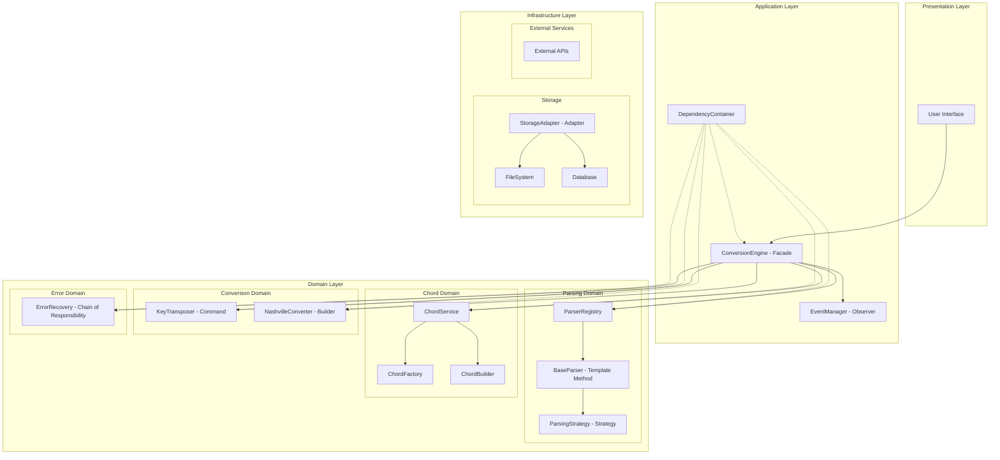

# Design Document

## Overview

Deze design document beschrijft de architecturale refactoring van de conversion engine om SOLID principes en bewezen design patterns toe te passen. De refactoring transformeert de huidige monolithische structuur naar een modulaire, uitbreidbare architectuur die gemakkelijk te onderhouden en te testen is.

De refactoring richt zich op acht hoofdcomponenten:
1. **BaseParser** - Refactoring naar Strategy en Template Method patterns
2. **ConversionEngine** - Implementatie van Facade en Observer patterns  
3. **ChordService** - Toepassing van Factory en Builder patterns
4. **KeyTransposer** - Implementatie van Command pattern
5. **NashvilleConverterService** - Toepassing van Builder pattern
6. **ParserRegistry** - Verbetering van Registry pattern implementatie
7. **ErrorRecovery** - Implementatie van Chain of Responsibility pattern
8. **FileOperations & Storage** - Toepassing van Adapter pattern

## Architecture

### High-Level Architecture



### SOLID Principles Implementation

#### Single Responsibility Principle (SRP)
- **BaseParser**: Alleen verantwoordelijk voor het coördineren van parsing workflow
- **ChordFactory**: Alleen verantwoordelijk voor het creëren van chord objecten
- **FormatDetector**: Alleen verantwoordelijk voor format detectie
- **ErrorRecoveryHandler**: Elke handler is verantwoordelijk voor één type error recovery

#### Open/Closed Principle (OCP)
- **ParsingStrategy**: Nieuwe formaten kunnen worden toegevoegd zonder bestaande code te wijzigen
- **ErrorRecoveryChain**: Nieuwe recovery strategieën kunnen worden toegevoegd zonder bestaande handlers te wijzigen
- **StorageAdapter**: Nieuwe storage backends kunnen worden toegevoegd via nieuwe adapters

#### Liskov Substitution Principle (LSP)
- **IParser**: Alle parser implementaties zijn uitwisselbaar
- **IStorageAdapter**: Alle storage adapters zijn uitwisselbaar
- **IErrorRecoveryHandler**: Alle error handlers zijn uitwisselbaar

#### Interface Segregation Principle (ISP)
- **IChordParser**: Specifiek voor chord parsing functionaliteit
- **IFormatValidator**: Specifiek voor format validatie
- **IKeyTransposer**: Specifiek voor key transposition
- **IEventPublisher**: Specifiek voor event publishing

#### Dependency Inversion Principle (DIP)
- Alle high-level modules zijn afhankelijk van abstractions (interfaces)
- Dependency injection container beheert alle dependencies
- Concrete implementaties worden geïnjecteerd via constructor injection

## Components and Interfaces

### 1. BaseParser Refactoring

#### Current Issues
- Monolithische klasse met te veel verantwoordelijkheden
- Tight coupling tussen parsing logica en format-specifieke details
- Moeilijk uitbreidbaar voor nieuwe formaten

#### New Design

```typescript
// Template Method Pattern
abstract class BaseParser implements IParser {
  constructor(
    private validator: IFormatValidator,
    private chordExtractor: IChordExtractionStrategy,
    private errorRecovery: IErrorRecoveryService
  ) {}

  // Template method
  public async parse(text: string): Promise<ParseResult> {
    const validationResult = this.validateInput(text);
    if (!validationResult.isValid) {
      return this.handleValidationError(validationResult);
    }

    const lines = this.parseLines(text);
    const processedLines = await this.processLines(lines);
    
    return this.buildResult(processedLines);
  }

  // Abstract methods for subclasses
  protected abstract validateInput(text: string): ValidationResult;
  protected abstract parseLines(text: string): RawLine[];
  protected abstract processLines(lines: RawLine[]): Promise<Line[]>;
}

// Strategy Pattern for chord extraction
interface IChordExtractionStrategy {
  extractChords(line: string): ChordPlacement[];
  isChordLine(line: string): boolean;
}

// Factory for creating strategies
class ChordExtractionStrategyFactory {
  static create(format: NotationFormat): IChordExtractionStrategy {
    switch (format) {
      case NotationFormat.ONSONG:
        return new OnSongChordStrategy();
      case NotationFormat.CHORDPRO:
        return new ChordProChordStrategy();
      // ... other formats
    }
  }
}
```

### 2. ConversionEngine Enhancement

#### Current Issues
- Direct instantiation van dependencies
- Geen event system voor status updates
- Beperkte error handling en recovery

#### New Design

```typescript
// Facade Pattern + Observer Pattern
class ConversionEngine implements IConversionEngine {
  constructor(
    private parserRegistry: IParserRegistry,
    private formatDetector: IFormatDetector,
    private keyTransposer: IKeyTransposer,
    private eventManager: IEventManager,
    private errorRecovery: IErrorRecoveryService
  ) {}

  async convert(request: ConversionRequest): Promise<ConversionResult> {
    this.eventManager.publish(new ConversionStartedEvent(request));
    
    try {
      const format = await this.detectFormat(request.input);
      const parser = this.parserRegistry.getParser(format);
      const canonicalModel = await parser.parse(request.input);
      
      if (request.transposeOptions) {
        await this.keyTransposer.transpose(canonicalModel, request.transposeOptions);
      }
      
      const result = await this.renderOutput(canonicalModel, request.targetFormat);
      
      this.eventManager.publish(new ConversionCompletedEvent(result));
      return result;
    } catch (error) {
      const recoveryResult = await this.errorRecovery.recover(error, request);
      this.eventManager.publish(new ConversionErrorEvent(error, recoveryResult));
      return recoveryResult;
    }
  }
}

// Event System
interface IEventManager {
  publish<T extends DomainEvent>(event: T): void;
  subscribe<T extends DomainEvent>(eventType: string, handler: EventHandler<T>): void;
}

abstract class DomainEvent {
  readonly timestamp = new Date();
  readonly id = crypto.randomUUID();
  abstract readonly type: string;
}
```

### 3. ChordService Refactoring

#### Current Issues
- Monolithische parsing logica
- Geen separation of concerns tussen parsing en creation
- Moeilijk uitbreidbaar voor nieuwe chord types

#### New Design

```typescript
// Factory Pattern + Builder Pattern
interface IChordFactory {
  createChord(chordString: string, position?: number): IChord;
  createNashvilleChord(number: number, quality: NashvilleQuality): INashvilleChord;
  createChordFromComponents(components: ChordComponents): IChord;
}

class ChordFactory implements IChordFactory {
  constructor(
    private parser: IChordParser,
    private validator: IChordValidator
  ) {}

  createChord(chordString: string, position = 0): IChord {
    const components = this.parser.parse(chordString);
    this.validator.validate(components);
    
    return new ChordBuilder()
      .setRoot(components.root)
      .setQuality(components.quality)
      .setExtensions(components.extensions)
      .setBassNote(components.bassNote)
      .setPosition(position)
      .setOriginalNotation(chordString)
      .build();
  }
}

// Builder Pattern for complex chord construction
class ChordBuilder implements IChordBuilder {
  private chord: Partial<IChord> = {};

  setRoot(root: string): IChordBuilder {
    this.chord.root = root;
    return this;
  }

  setQuality(quality: ChordQuality): IChordBuilder {
    this.chord.quality = quality;
    return this;
  }

  // ... other setter methods

  build(): IChord {
    this.validateChord();
    return new Chord(this.chord as ChordData);
  }

  private validateChord(): void {
    if (!this.chord.root) {
      throw new Error('Chord must have a root note');
    }
    // ... other validations
  }
}
```

### 4. KeyTransposer Command Pattern

#### Current Issues
- Geen undo functionaliteit
- Geen logging van transpositions
- Direct mutation van data

#### New Design

```typescript
// Command Pattern
interface ITransposeCommand {
  execute(): Promise<void>;
  undo(): Promise<void>;
  getDescription(): string;
}

class TransposeKeyCommand implements ITransposeCommand {
  private originalKey: string;
  private targetKey: string;
  private affectedChords: IChord[] = [];

  constructor(
    private canonicalModel: ICanonicalSongModel,
    private fromKey: string,
    private toKey: string,
    private transposer: IKeyTransposer
  ) {
    this.originalKey = fromKey;
    this.targetKey = toKey;
  }

  async execute(): Promise<void> {
    const semitones = this.transposer.getKeyDistance(this.originalKey, this.targetKey);
    
    for (const section of this.canonicalModel.sections) {
      for (const line of section.lines) {
        if (line.type === 'text') {
          for (const chordPlacement of line.chords) {
            const originalChord = { ...chordPlacement.chord };
            const transposedChord = this.transposer.transposeChord(
              chordPlacement.chord, 
              semitones, 
              this.targetKey
            );
            
            this.affectedChords.push({
              original: originalChord,
              transposed: transposedChord,
              placement: chordPlacement
            });
            
            chordPlacement.chord = transposedChord;
          }
        }
      }
    }
    
    this.canonicalModel.metadata.originalKey = this.targetKey;
  }

  async undo(): Promise<void> {
    for (const { original, placement } of this.affectedChords) {
      placement.chord = original;
    }
    this.canonicalModel.metadata.originalKey = this.originalKey;
    this.affectedChords = [];
  }

  getDescription(): string {
    return `Transpose from ${this.originalKey} to ${this.targetKey}`;
  }
}

// Command Manager
class TransposeCommandManager {
  private history: ITransposeCommand[] = [];
  private currentIndex = -1;

  async executeCommand(command: ITransposeCommand): Promise<void> {
    await command.execute();
    
    // Remove any commands after current index (for redo functionality)
    this.history = this.history.slice(0, this.currentIndex + 1);
    this.history.push(command);
    this.currentIndex++;
  }

  async undo(): Promise<boolean> {
    if (this.currentIndex >= 0) {
      const command = this.history[this.currentIndex];
      await command.undo();
      this.currentIndex--;
      return true;
    }
    return false;
  }

  async redo(): Promise<boolean> {
    if (this.currentIndex < this.history.length - 1) {
      this.currentIndex++;
      const command = this.history[this.currentIndex];
      await command.execute();
      return true;
    }
    return false;
  }
}
```

### 5. NashvilleConverter Builder Pattern

#### Current Issues
- Complex construction logic scattered throughout
- Moeilijk om verschillende Nashville varianten te ondersteunen
- Geen fluent interface voor configuration

#### New Design

```typescript
// Builder Pattern for Nashville notation
interface INashvilleBuilder {
  setKey(key: string): INashvilleBuilder;
  setTimeSignature(timeSignature: string): INashvilleBuilder;
  addChordProgression(progression: number[]): INashvilleBuilder;
  setRhythmicNotation(enabled: boolean): INashvilleBuilder;
  setBarNotation(enabled: boolean): INashvilleBuilder;
  build(): INashvilleNotation;
}

class NashvilleNotationBuilder implements INashvilleBuilder {
  private notation: Partial<INashvilleNotation> = {
    chords: [],
    rhythmicSymbols: [],
    barLines: []
  };

  setKey(key: string): INashvilleBuilder {
    this.notation.key = key;
    return this;
  }

  setTimeSignature(timeSignature: string): INashvilleBuilder {
    this.notation.timeSignature = timeSignature;
    return this;
  }

  addChordProgression(progression: number[]): INashvilleBuilder {
    const nashvilleChords = progression.map(num => 
      this.createNashvilleChord(num)
    );
    this.notation.chords!.push(...nashvilleChords);
    return this;
  }

  setRhythmicNotation(enabled: boolean): INashvilleBuilder {
    this.notation.includeRhythm = enabled;
    return this;
  }

  setBarNotation(enabled: boolean): INashvilleBuilder {
    this.notation.includeBarLines = enabled;
    return this;
  }

  build(): INashvilleNotation {
    this.validateNotation();
    return new NashvilleNotation(this.notation as NashvilleNotationData);
  }

  private validateNotation(): void {
    if (!this.notation.key) {
      throw new Error('Nashville notation must have a key');
    }
    if (!this.notation.chords || this.notation.chords.length === 0) {
      throw new Error('Nashville notation must have at least one chord');
    }
  }

  private createNashvilleChord(number: number): INashvilleChord {
    return new NashvilleChordBuilder()
      .setNumber(number)
      .setQuality(NashvilleQuality.MAJOR)
      .build();
  }
}

// Director for common Nashville patterns
class NashvilleNotationDirector {
  constructor(private builder: INashvilleBuilder) {}

  buildBasicProgression(key: string): INashvilleNotation {
    return this.builder
      .setKey(key)
      .setTimeSignature('4/4')
      .addChordProgression([1, 4, 5, 1])
      .setBarNotation(true)
      .build();
  }

  buildComplexProgression(key: string): INashvilleNotation {
    return this.builder
      .setKey(key)
      .setTimeSignature('4/4')
      .addChordProgression([1, 5, 6, 4])
      .setRhythmicNotation(true)
      .setBarNotation(true)
      .build();
  }
}
```

### 6. ErrorRecovery Chain of Responsibility

#### Current Issues
- Beperkte error recovery strategieën
- Geen flexibele chain configuratie
- Type safety issues

#### New Design

```typescript
// Chain of Responsibility Pattern
abstract class ErrorRecoveryHandler implements IErrorRecoveryHandler {
  protected nextHandler?: IErrorRecoveryHandler;

  setNext(handler: IErrorRecoveryHandler): IErrorRecoveryHandler {
    this.nextHandler = handler;
    return handler;
  }

  async handle(error: ConversionError, context: any): Promise<ErrorRecoveryResult> {
    const result = await this.doHandle(error, context);
    
    if (!result.success && this.nextHandler) {
      return this.nextHandler.handle(error, context);
    }
    
    return result;
  }

  protected abstract doHandle(error: ConversionError, context: any): Promise<ErrorRecoveryResult>;
}

// Concrete handlers
class InvalidChordRecoveryHandler extends ErrorRecoveryHandler {
  protected async doHandle(error: ConversionError, context: string): Promise<ErrorRecoveryResult> {
    if (error.type !== ConversionErrorType.PARSE_ERROR || !this.isChordError(error)) {
      return { success: false, errors: [error], warnings: [] };
    }

    const correctedChord = this.suggestChordCorrection(context);
    return {
      success: true,
      partialResult: this.createTextLine(correctedChord, error.line || 0),
      errors: [],
      warnings: [`Corrected invalid chord: "${context}" -> "${correctedChord}"`]
    };
  }

  private isChordError(error: ConversionError): boolean {
    return error.message.toLowerCase().includes('chord');
  }

  private suggestChordCorrection(invalidChord: string): string {
    // Advanced chord correction logic
    return invalidChord.replace(/[^A-G#b0-9msuj]/g, '');
  }
}

class MalformedSectionRecoveryHandler extends ErrorRecoveryHandler {
  protected async doHandle(error: ConversionError, context: string): Promise<ErrorRecoveryResult> {
    if (!this.isSectionError(error)) {
      return { success: false, errors: [error], warnings: [] };
    }

    const cleanedSection = this.cleanSectionContent(context);
    if (cleanedSection) {
      return {
        success: true,
        partialResult: this.createAnnotationLine(cleanedSection, error.line || 0),
        errors: [],
        warnings: [`Cleaned malformed section: "${context}" -> "${cleanedSection}"`]
      };
    }

    return { success: false, errors: [error], warnings: [] };
  }

  private isSectionError(error: ConversionError): boolean {
    return error.message.toLowerCase().includes('section');
  }

  private cleanSectionContent(content: string): string | null {
    const cleaned = content.replace(/[^\w\s\-]/g, '').trim();
    return cleaned.length > 0 ? cleaned : null;
  }
}

// Chain builder
class ErrorRecoveryChainBuilder {
  private firstHandler?: IErrorRecoveryHandler;
  private currentHandler?: IErrorRecoveryHandler;

  addHandler(handler: IErrorRecoveryHandler): ErrorRecoveryChainBuilder {
    if (!this.firstHandler) {
      this.firstHandler = handler;
      this.currentHandler = handler;
    } else {
      this.currentHandler!.setNext(handler);
      this.currentHandler = handler;
    }
    return this;
  }

  build(): IErrorRecoveryHandler {
    if (!this.firstHandler) {
      throw new Error('Chain must have at least one handler');
    }
    return this.firstHandler;
  }
}
```

### 7. Storage Adapter Pattern

#### Current Issues
- Direct file system dependencies
- Geen abstractie voor verschillende storage types
- Moeilijk testbaar

#### New Design

```typescript
// Adapter Pattern for storage
interface IStorageAdapter {
  read(path: string): Promise<string>;
  write(path: string, content: string): Promise<void>;
  exists(path: string): Promise<boolean>;
  delete(path: string): Promise<void>;
  list(directory: string): Promise<string[]>;
}

class FileSystemStorageAdapter implements IStorageAdapter {
  async read(path: string): Promise<string> {
    // File system implementation
    return fs.readFile(path, 'utf-8');
  }

  async write(path: string, content: string): Promise<void> {
    await fs.writeFile(path, content, 'utf-8');
  }

  async exists(path: string): Promise<boolean> {
    try {
      await fs.access(path);
      return true;
    } catch {
      return false;
    }
  }

  async delete(path: string): Promise<void> {
    await fs.unlink(path);
  }

  async list(directory: string): Promise<string[]> {
    return fs.readdir(directory);
  }
}

class DatabaseStorageAdapter implements IStorageAdapter {
  constructor(private db: IDatabase) {}

  async read(path: string): Promise<string> {
    const result = await this.db.query('SELECT content FROM files WHERE path = ?', [path]);
    return result[0]?.content || '';
  }

  async write(path: string, content: string): Promise<void> {
    await this.db.query(
      'INSERT OR REPLACE INTO files (path, content) VALUES (?, ?)',
      [path, content]
    );
  }

  // ... other methods
}

// Storage service using adapter
class StorageService {
  constructor(private adapter: IStorageAdapter) {}

  async saveConversionResult(result: ConversionResult, filename: string): Promise<void> {
    const content = JSON.stringify(result, null, 2);
    await this.adapter.write(filename, content);
  }

  async loadConversionHistory(): Promise<ConversionResult[]> {
    const files = await this.adapter.list('./conversions');
    const results: ConversionResult[] = [];
    
    for (const file of files) {
      if (file.endsWith('.json')) {
        const content = await this.adapter.read(`./conversions/${file}`);
        results.push(JSON.parse(content));
      }
    }
    
    return results;
  }
}
```

## Data Models

### Enhanced Type System

```typescript
// Clear, descriptive type names
interface IConversionRequest {
  readonly input: string;
  readonly sourceFormat?: NotationFormat;
  readonly targetFormat: NotationFormat;
  readonly transposeOptions?: ITransposeOptions;
  readonly conversionOptions?: IConversionOptions;
}

interface ITransposeOptions {
  readonly fromKey: string;
  readonly toKey: string;
  readonly preserveOriginalKey?: boolean;
}

interface IConversionOptions {
  readonly includeMetadata: boolean;
  readonly preserveFormatting: boolean;
  readonly errorRecoveryLevel: ErrorRecoveryLevel;
}

enum ErrorRecoveryLevel {
  STRICT = 'strict',
  MODERATE = 'moderate',
  PERMISSIVE = 'permissive'
}

// Domain-specific value objects
class ChordRoot {
  constructor(private readonly value: string) {
    this.validate();
  }

  private validate(): void {
    if (!/^[A-G][#b]?$/.test(this.value)) {
      throw new Error(`Invalid chord root: ${this.value}`);
    }
  }

  toString(): string {
    return this.value;
  }

  equals(other: ChordRoot): boolean {
    return this.value === other.value;
  }
}

class NashvilleNumber {
  constructor(private readonly value: number) {
    this.validate();
  }

  private validate(): void {
    if (this.value < 1 || this.value > 7) {
      throw new Error(`Nashville number must be between 1 and 7, got: ${this.value}`);
    }
  }

  toRomanNumeral(): string {
    const numerals = ['I', 'II', 'III', 'IV', 'V', 'VI', 'VII'];
    return numerals[this.value - 1];
  }

  getValue(): number {
    return this.value;
  }
}
```

## Error Handling

### Comprehensive Error Strategy

```typescript
// Error hierarchy
abstract class ConversionDomainError extends Error {
  abstract readonly errorCode: string;
  abstract readonly recoverable: boolean;
  
  constructor(
    message: string,
    public readonly context?: any
  ) {
    super(message);
    this.name = this.constructor.name;
  }
}

class ChordParsingError extends ConversionDomainError {
  readonly errorCode = 'CHORD_PARSING_ERROR';
  readonly recoverable = true;
}

class FormatDetectionError extends ConversionDomainError {
  readonly errorCode = 'FORMAT_DETECTION_ERROR';
  readonly recoverable = false;
}

class KeyTranspositionError extends ConversionDomainError {
  readonly errorCode = 'KEY_TRANSPOSITION_ERROR';
  readonly recoverable = true;
}

// Error recovery with detailed reporting
interface IErrorRecoveryReport {
  readonly originalError: ConversionDomainError;
  readonly recoveryStrategy: string;
  readonly recoverySuccess: boolean;
  readonly partialResult?: any;
  readonly warnings: string[];
  readonly suggestions: string[];
}
```

## Testing Strategy

### Comprehensive Testing Approach

1. **Unit Tests**
   - Elke klasse heeft zijn eigen test suite
   - Mocking van dependencies via interfaces
   - Test coverage van minimaal 90%

2. **Integration Tests**
   - End-to-end conversion workflows
   - Error recovery scenarios
   - Performance benchmarks

3. **Contract Tests**
   - Interface compliance tests
   - Adapter pattern implementations
   - Strategy pattern implementations

4. **Property-Based Tests**
   - Chord parsing roundtrip tests
   - Key transposition invariants
   - Format conversion consistency

```typescript
// Example test structure
describe('ChordFactory', () => {
  let factory: IChordFactory;
  let mockParser: jest.Mocked<IChordParser>;
  let mockValidator: jest.Mocked<IChordValidator>;

  beforeEach(() => {
    mockParser = createMockChordParser();
    mockValidator = createMockChordValidator();
    factory = new ChordFactory(mockParser, mockValidator);
  });

  describe('createChord', () => {
    it('should create valid chord from string', () => {
      // Arrange
      const chordString = 'Cmaj7';
      const expectedComponents = { root: 'C', quality: ChordQuality.MAJOR };
      mockParser.parse.mockReturnValue(expectedComponents);
      mockValidator.validate.mockReturnValue(true);

      // Act
      const result = factory.createChord(chordString);

      // Assert
      expect(result.root).toBe('C');
      expect(result.quality).toBe(ChordQuality.MAJOR);
      expect(mockParser.parse).toHaveBeenCalledWith(chordString);
      expect(mockValidator.validate).toHaveBeenCalledWith(expectedComponents);
    });
  });
});
```

Deze design biedt een robuuste, uitbreidbare architectuur die alle SOLID principes respecteert en bewezen design patterns toepast voor maximale onderhoudbaarheid en testbaarheid.