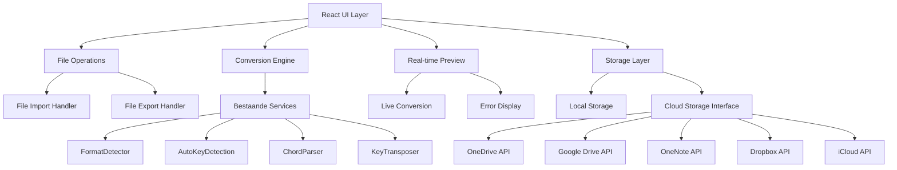

# Design Document

## Overview

Deze uitbreiding bouwt voort op de bestaande Music Notation Converter infrastructuur door bestandsoperaties en een complete gebruikersinterface toe te voegen. De bestaande services (FormatDetector, AutoKeyDetection, ChordParser, KeyTransposer) worden geïntegreerd in een React-gebaseerde UI met real-time preview en bestandsimport/export functionaliteit.

## Architecture

### Bestaande Infrastructuur (al geïmplementeerd)
- **FormatDetector**: Automatische detectie van notatie formaten
- **AutoKeyDetection**: Automatische key detectie op basis van chord progressies  
- **ChordParser**: Parsing van chord strings naar gestructureerde objecten
- **KeyTransposer**: Transposition tussen verschillende keys
- **Type Definitions**: Complete type systeem voor chords, formats, etc.

### Nieuwe Componenten



## Components and Interfaces

### Nieuwe React Componenten

```typescript
// Main Application Component
interface AppState {
  inputText: string;
  outputText: string;
  sourceFormat: NotationFormat;
  targetFormat: NotationFormat;
  sourceKey: string;
  targetKey: string;
  isLoading: boolean;
  error: string | null;
  metadata: {
    title?: string;
    artist?: string;
    key?: string;
  };
}

// File Operations Interface (Extensible voor Cloud Storage)
interface FileOperations {
  importFile(file: File): Promise<ImportResult>;
  exportFile(content: string, format: NotationFormat, metadata: Metadata): void;
  generateFileName(metadata: Metadata, format: NotationFormat): string;
}

interface ImportResult {
  content: string;
  detectedFormat: NotationFormat;
  detectedKey: string;
  metadata: Metadata;
  source: FileSource;
}

// Storage Abstraction Layer (voor toekomstige cloud integratie)
interface StorageProvider {
  name: string;
  type: 'local' | 'cloud';
  isAuthenticated: boolean;
  
  // Basis operaties
  listFiles(folder?: string): Promise<StorageFile[]>;
  readFile(fileId: string): Promise<string>;
  writeFile(fileId: string, content: string, metadata?: FileMetadata): Promise<void>;
  deleteFile(fileId: string): Promise<void>;
  
  // Folder operaties
  createFolder(name: string, parentId?: string): Promise<string>;
  listFolders(parentId?: string): Promise<StorageFolder[]>;
  
  // Authenticatie (voor cloud providers)
  authenticate?(): Promise<void>;
  disconnect?(): Promise<void>;
}

interface StorageFile {
  id: string;
  name: string;
  size: number;
  lastModified: Date;
  format?: NotationFormat;
  metadata?: FileMetadata;
  provider: string;
}

interface StorageFolder {
  id: string;
  name: string;
  parentId?: string;
  provider: string;
}

// Conversion Engine Interface
interface ConversionEngine {
  convert(
    input: string,
    sourceFormat: NotationFormat,
    targetFormat: NotationFormat,
    sourceKey?: string,
    targetKey?: string
  ): Promise<ConversionResult>;
}

interface ConversionResult {
  output: string;
  success: boolean;
  errors: ConversionError[];
  warnings: string[];
}
```

### Component Structuur

```
src/components/
├── layout/
│   ├── AppLayout.tsx           // Main layout wrapper
│   ├── Header.tsx              // App header met titel en controls
│   └── Footer.tsx              // Footer met info
├── editor/
│   ├── InputEditor.tsx         // Tekst input met syntax highlighting
│   ├── OutputPreview.tsx       // Real-time preview van conversie
│   ├── EditorSplitView.tsx     // Split-screen container
│   └── EditorToolbar.tsx       // Toolbar met format/key selectors
├── controls/
│   ├── FormatSelector.tsx      // Dropdown voor formaat selectie
│   ├── KeySelector.tsx         // Dropdown voor key selectie
│   ├── FileImportButton.tsx    // Bestand import knop
│   ├── FileExportButton.tsx    // Bestand export knop
│   └── CopyToClipboard.tsx     // Kopieer naar klembord knop
├── storage/                    // Nieuwe storage componenten
│   ├── StorageProvider.tsx     // Storage provider selector
│   ├── FileExplorer.tsx        // File browser voor cloud/local files
│   ├── FolderTree.tsx          // Folder navigation tree
│   ├── CloudAuthButton.tsx     // Cloud service authenticatie
│   └── StorageSettings.tsx     // Storage configuratie
├── feedback/
│   ├── ErrorDisplay.tsx        // Error messages en warnings
│   ├── LoadingSpinner.tsx      // Loading indicator
│   └── StatusIndicator.tsx     // Status van format/key detection
└── metadata/
    ├── MetadataEditor.tsx      // Editor voor titel/artiest
    └── MetadataDisplay.tsx     // Display van gedetecteerde metadata
```

## Data Models

### File Import/Export Models (Extensible voor Cloud Storage)

```typescript
interface ImportedFile {
  name: string;
  content: string;
  size: number;
  lastModified: Date;
  detectedFormat: NotationFormat;
  detectedKey: string;
  confidence: number;
  metadata: FileMetadata;
  source: FileSource;
}

interface FileSource {
  type: 'local' | 'onedrive' | 'googledrive' | 'onenote' | 'dropbox' | 'icloud';
  provider?: string;
  fileId?: string;
  path?: string;
}

interface FileMetadata {
  title?: string;
  artist?: string;
  key?: string;
  tempo?: number;
  timeSignature?: string;
  capo?: number;
  originalFormat?: NotationFormat;
  tags?: string[];
  collection?: string;
  dateCreated?: Date;
  lastModified?: Date;
}

interface ExportOptions {
  format: NotationFormat;
  filename?: string;
  includeMetadata: boolean;
  preserveFormatting: boolean;
  destination: FileSource;
  createBackup?: boolean;
}

// Song Collection Management (voor toekomstige features)
interface SongCollection {
  id: string;
  name: string;
  description?: string;
  songs: StorageFile[];
  provider: string;
  folderId?: string;
  tags?: string[];
  dateCreated: Date;
  lastModified: Date;
}
```

### Conversion Pipeline

```typescript
interface ConversionPipeline {
  input: string;
  sourceFormat: NotationFormat;
  targetFormat: NotationFormat;
  sourceKey?: string;
  targetKey?: string;
  options: ConversionOptions;
}

interface ConversionOptions {
  preserveExtensions: boolean;
  handleSlashChords: boolean;
  convertAnnotations: boolean;
  maintainSpacing: boolean;
  autoDetectKey: boolean;
}
```

## Error Handling

### Error Types en Behandeling

```typescript
enum ConversionErrorType {
  PARSE_ERROR = 'PARSE_ERROR',
  FORMAT_ERROR = 'FORMAT_ERROR',
  KEY_ERROR = 'KEY_ERROR',
  FILE_ERROR = 'FILE_ERROR',
  NETWORK_ERROR = 'NETWORK_ERROR'
}

interface ConversionError {
  type: ConversionErrorType;
  message: string;
  line?: number;
  column?: number;
  suggestion?: string;
  recoverable: boolean;
}

// Error Recovery Strategies
class ErrorRecovery {
  static recoverFromParseError(error: ConversionError, input: string): string;
  static suggestFormatCorrection(error: ConversionError): string[];
  static fallbackConversion(input: string): string;
}
```

### Graceful Degradation

1. **Format Detection Failure**: Fallback naar manual format selectie
2. **Key Detection Failure**: Gebruik default key (C major) met waarschuwing
3. **Partial Conversion**: Converteer wat mogelijk is, markeer problemen
4. **File Import Errors**: Toon duidelijke foutmelding met suggesties

## Testing Strategy

### Unit Tests voor Nieuwe Componenten

```typescript
// File Operations Tests
describe('FileOperations', () => {
  it('should import text files correctly');
  it('should detect format from file content');
  it('should extract metadata from ChordPro files');
  it('should generate appropriate filenames');
  it('should handle file read errors gracefully');
});

// UI Component Tests
describe('InputEditor', () => {
  it('should update on text input');
  it('should trigger format detection on change');
  it('should display syntax highlighting');
  it('should handle large files efficiently');
});

describe('OutputPreview', () => {
  it('should update in real-time');
  it('should display conversion errors');
  it('should maintain scroll position');
  it('should handle empty input gracefully');
});
```

### Integration Tests

```typescript
describe('Full Conversion Workflow', () => {
  it('should import file, detect format, convert, and export');
  it('should handle format changes with real-time update');
  it('should transpose keys while preserving extensions');
  it('should maintain metadata through conversion process');
});
```

## Implementation Phases

### Phase 1: Core UI Components (Task 1)
- Implementeer basis layout en split-screen interface
- Creëer InputEditor en OutputPreview componenten
- Integreer bestaande FormatDetector voor real-time detection
- Voeg basis error handling toe
- Creëer storage abstraction layer (voorbereidend voor cloud integratie)

### Phase 2: File Operations & Advanced Features (Task 2)  
- Implementeer file import/export functionaliteit
- Integreer AutoKeyDetection en KeyTransposer
- Voeg metadata editing toe
- Implementeer copy-to-clipboard functionaliteit
- Voeg comprehensive error handling en user feedback toe
- Implementeer basis local storage provider (foundation voor cloud providers)

### Toekomstige Phases (niet in deze spec):
- **Phase 3**: OneDrive integratie met Microsoft Graph API
- **Phase 4**: Google Drive integratie met Google Drive API  
- **Phase 5**: Dropbox integratie met Dropbox API
- **Phase 6**: iCloud integratie (via CloudKit JS voor web)
- **Phase 7**: OneNote integratie voor song collections
- **Phase 8**: Song collection management en tagging systeem

## Security Considerations

- **File Upload Security**: Valideer bestandstypen en grootte
- **Content Sanitization**: Sanitize geïmporteerde tekst content
- **Client-Side Processing**: Alle verwerking gebeurt client-side (geen server uploads)
- **Memory Management**: Efficiënte handling van grote bestanden
- **XSS Prevention**: Proper escaping van user input in preview
- **Cloud Storage Security**: 
  - OAuth 2.0 flows voor cloud provider authenticatie
  - Secure token storage (encrypted localStorage/sessionStorage)
  - API rate limiting en error handling
  - Permission scoping (alleen benodigde rechten vragen)
- **Data Privacy**: 
  - Geen permanente opslag van cloud credentials
  - User consent voor cloud storage toegang
  - Transparante data handling policies

## Performance Optimizations

- **Debounced Input**: Debounce real-time conversie voor performance
- **Lazy Loading**: Lazy load conversion engines voor snellere startup
- **Memoization**: Cache conversion results voor identieke input
- **Virtual Scrolling**: Voor grote chord sheets in preview
- **Web Workers**: Overweeg web workers voor zware conversies

## Accessibility Features

- **Keyboard Navigation**: Volledige keyboard support
- **Screen Reader Support**: Proper ARIA labels en descriptions
- **High Contrast Mode**: Support voor high contrast themes
- **Font Size Controls**: Aanpasbare font grootte voor leesbaarheid
- **Focus Management**: Proper focus management in modals en dialogs