# Design Document

## Overview

The Music Converter Optimization project enhances the existing music notation converter with a refined Canonical Song Data Model, optimized parsing and rendering engines, advanced UI animations, and comprehensive testing. The design builds upon the current architecture while introducing significant improvements in flexibility, performance, and user experience.

The optimization focuses on three core areas:
1. **Data Model Enhancement**: Explicit support for empty lines, complex annotations, and improved type safety
2. **Engine Optimization**: Separate parsing and rendering engines with robust error handling
3. **User Experience**: Advanced animations, responsive design, and comprehensive testing

## Architecture

### Enhanced High-Level Architecture

```mermaid
graph TB
    UI[React UI Components] --> ConversionEngine[Conversion Engine]
    ConversionEngine --> FormatDetector[Format Detector]
    ConversionEngine --> ParsingEngine[Parsing Engine]
    ConversionEngine --> RenderingEngine[Rendering Engine]
    ConversionEngine --> TranspositionEngine[Transposition Engine]
    
    ParsingEngine --> CoreParser[Core Parser]
    ParsingEngine --> FormatParsers[Format-Specific Parsers]
    FormatParsers --> ChordProParser[ChordPro Parser]
    FormatParsers --> OnSongParser[OnSong Parser]
    FormatParsers --> SongbookParser[Songbook Parser]
    FormatParsers --> GuitarTabsParser[Guitar Tabs Parser]
    FormatParsers --> NashvilleParser[Nashville Parser]
    
    RenderingEngine --> CoreRenderer[Core Renderer]
    RenderingEngine --> FormatRenderers[Format-Specific Renderers]
    FormatRenderers --> ChordProRenderer[ChordPro Renderer]
    FormatRenderers --> OnSongRenderer[OnSong Renderer]
    FormatRenderers --> SongbookRenderer[Songbook Renderer]
    FormatRenderers --> GuitarTabsRenderer[Guitar Tabs Renderer]
    FormatRenderers --> NashvilleRenderer[Nashville Renderer]
    
    TranspositionEngine --> KeyTransposer[Key Transposer]
    TranspositionEngine --> NashvilleConverter[Nashville Converter]
    TranspositionEngine --> ChordMapper[Chord Mapper]
    
    CoreParser --> CanonicalModel[Canonical Song Data Model]
    CoreRenderer --> CanonicalModel
    TranspositionEngine --> CanonicalModel
```



### Technology Stack Enhancements

- **Frontend Framework**: Next.js 14 with React 18 (existing)
- **Styling**: Tailwind CSS with enhanced design system
- **Animation**: React Spring or Framer Motion for smooth transitions
- **State Management**: React Context API with useReducer (existing)
- **Testing**: Jest + React Testing Library + Cypress for E2E
- **Type Safety**: Enhanced TypeScript with discriminated unions
- **Performance**: React.memo, useMemo, useCallback optimizations

## Components and Interfaces

### Enhanced Core Interfaces

```typescript
// Enhanced Chordsheet interface
interface Chordsheet {
  id: string;
  title: string;
  artist?: string;
  originalKey: string;
  sections: Section[];
  metadata?: Metadata;
}

// Enhanced Section interface
interface Section {
  type: 'verse' | 'chorus' | 'bridge' | 'pre-chorus' | 'intro' | 'outro' | 
        'instrumental' | 'solo' | 'coda' | 'tag' | 'note' | 'unknown';
  title?: string;
  lines: Line[];
}

// Discriminated union for Line types
type Line = TextLine | EmptyLine | AnnotationLine;

interface TextLine {
  type: 'text';
  text: string;
  chords: ChordPlacement[];
}

interface EmptyLine {
  type: 'empty';
  count?: number;
}

interface AnnotationLine {
  type: 'annotation';
  value: string;
  annotationType: 'comment' | 'instruction';
}

// Enhanced ChordPlacement interface
interface ChordPlacement {
  value: string;           // Canonical chord representation
  originalText: string;    // Original text as parsed
  startIndex: number;      // Start position in text
  endIndex: number;        // End position in text
}

// Error handling interfaces
interface ConversionError {
  type: 'PARSE_ERROR' | 'RENDER_ERROR' | 'TRANSPOSE_ERROR' | 'FORMAT_ERROR';
  message: string;
  line?: number;
  column?: number;
  suggestion?: string;
  recoverable: boolean;
}

interface ErrorRecoveryResult {
  success: boolean;
  partialResult?: any;
  errors: ConversionError[];
  warnings: string[];
}
```

### Enhanced Component Structure

```
src/
├── components/
│   ├── layout/
│   │   ├── AppLayout.tsx           # Enhanced responsive layout
│   │   ├── Header.tsx              # Updated header with animations
│   │   └── Footer.tsx              # Enhanced footer
│   ├── editor/
│   │   ├── InputEditor.tsx         # Enhanced input with validation
│   │   ├── OutputPreview.tsx       # Optimized preview with Line type rendering
│   │   ├── FormatSelector.tsx      # Enhanced format selection
│   │   └── KeySelector.tsx         # Improved key selection
│   ├── controls/
│   │   ├── ConversionControls.tsx  # Enhanced conversion controls
│   │   ├── TranspositionControls.tsx # New transposition controls
│   │   └── MetadataEditor.tsx      # Enhanced metadata editing
│   ├── feedback/
│   │   ├── LoadingSpinner.tsx      # Optimized loading indicators
│   │   ├── ErrorDisplay.tsx        # Enhanced error display
│   │   └── ProgressIndicator.tsx   # New progress feedback
│   └── animations/
│       ├── ChordTransition.tsx     # Chord transposition animations
│       ├── FormatTransition.tsx    # Format conversion animations
│       └── FadeTransition.tsx      # General fade transitions
├── parsers/
│   ├── core/
│   │   ├── base-parser.ts          # Enhanced base parser
│   │   ├── parser.interface.ts     # Parser interface definition
│   │   └── section-parser.ts       # Enhanced section parsing
│   ├── annotations/
│   │   ├── chord-pro.ts           # Enhanced ChordPro parser
│   │   ├── on-song.ts             # Enhanced OnSong parser
│   │   ├── songbook.ts            # Enhanced Songbook parser
│   │   ├── guitar-tabs.ts         # Enhanced Guitar Tabs parser
│   │   └── nashville-number-system.ts # New Nashville parser
│   └── index.ts                   # Parser factory
├── renderers/                     # New rendering engine
│   ├── core/
│   │   ├── base-renderer.ts       # Base renderer class
│   │   ├── renderer.interface.ts  # Renderer interface
│   │   └── line-renderer.ts       # Line type rendering logic
│   ├── formats/
│   │   ├── chord-pro.ts          # ChordPro renderer
│   │   ├── on-song.ts            # OnSong renderer
│   │   ├── songbook.ts           # Songbook renderer
│   │   ├── guitar-tabs.ts        # Guitar Tabs renderer
│   │   └── nashville.ts          # Nashville renderer
│   └── index.ts                  # Renderer factory
├── services/
│   ├── conversion-engine.ts       # Enhanced conversion orchestrator
│   ├── format-detector.ts         # Enhanced format detection
│   ├── error-recovery.ts          # New error recovery service
│   └── performance-monitor.ts     # New performance monitoring
├── utils/
│   ├── chord-parser.ts           # Enhanced chord parsing
│   ├── key-transposer.ts         # Enhanced transposition
│   ├── nashville-converter.ts    # Enhanced Nashville conversion
│   └── validation.ts             # New validation utilities
└── types/
    ├── chordsheet.ts             # Enhanced chordsheet types
    ├── section.ts                # Enhanced section types
    ├── line.ts                   # New line types
    ├── chord.ts                  # Enhanced chord types
    ├── annotation.ts             # Enhanced annotation types
    ├── conversion-error.ts       # New error types
    └── metadata.ts               # Enhanced metadata types
```

## Data Models

### Canonical Song Data Model

The enhanced canonical model serves as the single source of truth for all conversions:

```typescript
// Core canonical model
interface CanonicalSongModel {
  metadata: {
    id: string;
    title: string;
    artist?: string;
    originalKey: string;
    detectedKey?: string;
    confidence?: number;
  };
  sections: CanonicalSection[];
  parseInfo: {
    sourceFormat: NotationFormat;
    parseTimestamp: Date;
    parseErrors: ConversionError[];
    parseWarnings: string[];
  };
}

interface CanonicalSection {
  type: SectionType;
  title?: string;
  lines: CanonicalLine[];
  metadata?: {
    repeatCount?: number;
    tempo?: string;
    dynamics?: string;
  };
}

type CanonicalLine = CanonicalTextLine | CanonicalEmptyLine | CanonicalAnnotationLine;

interface CanonicalTextLine {
  type: 'text';
  text: string;
  chords: CanonicalChordPlacement[];
  lineNumber?: number;
}

interface CanonicalEmptyLine {
  type: 'empty';
  count: number;
  lineNumber?: number;
}

interface CanonicalAnnotationLine {
  type: 'annotation';
  value: string;
  annotationType: 'comment' | 'instruction' | 'tempo' | 'dynamics';
  originalFormat: AnnotationFormat;
  lineNumber?: number;
}

interface CanonicalChordPlacement {
  chord: CanonicalChord;
  position: ChordPosition;
  originalText: string;
}

interface CanonicalChord {
  root: string;
  quality: ChordQuality;
  extensions: ChordExtension[];
  bassNote?: string;
  originalNotation: string;
  nashvilleNumber?: string;
}

interface ChordPosition {
  startIndex: number;
  endIndex: number;
  placement: 'above' | 'inline' | 'between';
}

enum ChordQuality {
  MAJOR = 'maj',
  MINOR = 'min',
  DIMINISHED = 'dim',
  AUGMENTED = 'aug',
  SUSPENDED = 'sus',
  DOMINANT = 'dom'
}

interface ChordExtension {
  type: 'add' | 'sus' | 'maj' | 'min' | 'dim' | 'aug';
  value: string;
  position: number;
}
```

### Nashville Number System Enhancement

```typescript
interface NashvilleChord {
  number: number;           // 1-7
  quality: NashvilleQuality;
  accidental?: '#' | 'b';
  extensions: string[];
  bassNumber?: number;
  bassAccidental?: '#' | 'b';
  rhythmicSymbols: RhythmicSymbol[];
}

enum NashvilleQuality {
  MAJOR = '',
  MINOR = 'm',
  DIMINISHED = '°',
  AUGMENTED = '+',
  SUSPENDED = 'sus'
}

interface RhythmicSymbol {
  symbol: '◆' | '^' | '.' | '<' | '>';
  position: 'before' | 'after';
  meaning: string;
}

// Nashville conversion utilities
class EnhancedNashvilleConverter {
  static toNashville(chord: CanonicalChord, key: string): NashvilleChord;
  static fromNashville(nashville: NashvilleChord, key: string): CanonicalChord;
  static transposeNashville(nashville: NashvilleChord, semitones: number): NashvilleChord;
  static parseRhythmicSymbols(text: string): RhythmicSymbol[];
}
```

## Error Handling

### Comprehensive Error Recovery System

```typescript
interface ErrorRecoveryStrategy {
  type: 'SKIP' | 'SUBSTITUTE' | 'PARTIAL' | 'FALLBACK';
  description: string;
  apply(input: any, error: ConversionError): ErrorRecoveryResult;
}

class ErrorRecoveryService {
  private strategies: Map<string, ErrorRecoveryStrategy>;

  constructor() {
    this.strategies = new Map([
      ['INVALID_CHORD', new InvalidChordStrategy()],
      ['MALFORMED_SECTION', new MalformedSectionStrategy()],
      ['UNKNOWN_ANNOTATION', new UnknownAnnotationStrategy()],
      ['PARSE_FAILURE', new ParseFailureStrategy()]
    ]);
  }

  recover(error: ConversionError, context: any): ErrorRecoveryResult {
    const strategy = this.strategies.get(error.type);
    if (strategy) {
      return strategy.apply(context, error);
    }
    return this.defaultRecovery(error, context);
  }

  private defaultRecovery(error: ConversionError, context: any): ErrorRecoveryResult {
    return {
      success: false,
      errors: [error],
      warnings: ['Applied default error recovery']
    };
  }
}

// Specific error recovery strategies
class InvalidChordStrategy implements ErrorRecoveryStrategy {
  type = 'SUBSTITUTE' as const;
  description = 'Replace invalid chords with closest valid match';

  apply(input: string, error: ConversionError): ErrorRecoveryResult {
    // Implementation for chord substitution
    const suggestion = this.suggestChordCorrection(input);
    return {
      success: true,
      partialResult: suggestion,
      errors: [],
      warnings: [`Replaced invalid chord "${input}" with "${suggestion}"`]
    };
  }

  private suggestChordCorrection(invalidChord: string): string {
    // Chord correction logic
    return invalidChord.replace(/[^A-G#b0-9msuj]/g, '');
  }
}
```

## Testing Strategy

### Enhanced Testing Architecture

```typescript
// Test data management
interface TestSample {
  name: string;
  format: NotationFormat;
  content: string;
  expectedOutput: {
    [key in NotationFormat]?: string;
  };
  metadata: {
    key?: string;
    complexity: 'simple' | 'moderate' | 'complex';
    features: string[];
  };
}

// Test suite organization
const TEST_SAMPLES: TestSample[] = [
  {
    name: 'simple-verse-chorus',
    format: NotationFormat.ONSONG,
    content: '[C]Amazing [F]grace how [G]sweet the [C]sound',
    expectedOutput: {
      [NotationFormat.SONGBOOK]: 'C       F       G       C\nAmazing grace how sweet the sound',
      [NotationFormat.NASHVILLE]: '[1]Amazing [4]grace how [5]sweet the [1]sound'
    },
    metadata: {
      key: 'C',
      complexity: 'simple',
      features: ['basic-chords', 'inline-placement']
    }
  },
  {
    name: 'complex-with-annotations',
    format: NotationFormat.SONGBOOK,
    content: '(Slowly)\nC       F       G       C\nAmazing grace how sweet the sound\n\n\nC       Am      F       G\nThat saved a wretch like me',
    expectedOutput: {
      [NotationFormat.ONSONG]: '*Slowly\n[C]Amazing [F]grace how [G]sweet the [C]sound\n\n[C]That [Am]saved a [F]wretch like [G]me'
    },
    metadata: {
      key: 'C',
      complexity: 'moderate',
      features: ['annotations', 'empty-lines', 'chord-over-lyrics']
    }
  }
];

// Performance testing utilities
class PerformanceTestSuite {
  static async testConversionSpeed(samples: TestSample[]): Promise<PerformanceResult[]> {
    const results: PerformanceResult[] = [];
    
    for (const sample of samples) {
      const startTime = performance.now();
      await ConversionEngine.convert(sample.content, sample.format, NotationFormat.ONSONG);
      const endTime = performance.now();
      
      results.push({
        sampleName: sample.name,
        duration: endTime - startTime,
        complexity: sample.metadata.complexity,
        passed: endTime - startTime < 100 // 100ms threshold
      });
    }
    
    return results;
  }

  static async testMemoryUsage(largeFile: string): Promise<MemoryUsageResult> {
    const initialMemory = (performance as any).memory?.usedJSHeapSize || 0;
    
    await ConversionEngine.convert(largeFile, NotationFormat.ONSONG, NotationFormat.SONGBOOK);
    
    const finalMemory = (performance as any).memory?.usedJSHeapSize || 0;
    
    return {
      initialMemory,
      finalMemory,
      memoryIncrease: finalMemory - initialMemory,
      acceptable: (finalMemory - initialMemory) < 10 * 1024 * 1024 // 10MB threshold
    };
  }
}

interface PerformanceResult {
  sampleName: string;
  duration: number;
  complexity: string;
  passed: boolean;
}

interface MemoryUsageResult {
  initialMemory: number;
  finalMemory: number;
  memoryIncrease: number;
  acceptable: boolean;
}
```

### Visual Regression Testing

```typescript
// Cypress visual testing configuration
describe('Visual Regression Tests', () => {
  const testCases = [
    { name: 'empty-state', viewport: 'desktop' },
    { name: 'simple-conversion', viewport: 'desktop' },
    { name: 'complex-conversion', viewport: 'desktop' },
    { name: 'mobile-layout', viewport: 'mobile' },
    { name: 'tablet-layout', viewport: 'tablet' }
  ];

  testCases.forEach(({ name, viewport }) => {
    it(`should match ${name} on ${viewport}`, () => {
      cy.viewport(viewport === 'mobile' ? 375 : viewport === 'tablet' ? 768 : 1280, 
                  viewport === 'mobile' ? 667 : viewport === 'tablet' ? 1024 : 720);
      cy.visit('/');
      cy.loadTestData(name);
      cy.matchImageSnapshot(`${name}-${viewport}`);
    });
  });
});

// Animation testing
describe('Animation Tests', () => {
  it('should animate chord transposition smoothly', () => {
    cy.visit('/');
    cy.loadSampleSong();
    cy.get('[data-testid="key-selector"]').select('D');
    cy.get('[data-testid="chord-element"]').should('have.class', 'animating');
    cy.wait(500); // Animation duration
    cy.get('[data-testid="chord-element"]').should('not.have.class', 'animating');
    cy.get('[data-testid="chord-element"]').should('contain', 'D');
  });

  it('should transition between formats smoothly', () => {
    cy.visit('/');
    cy.loadSampleSong();
    cy.get('[data-testid="format-selector"]').select('songbook');
    cy.get('[data-testid="output-preview"]').should('have.class', 'format-transitioning');
    cy.wait(300); // Transition duration
    cy.get('[data-testid="output-preview"]').should('not.have.class', 'format-transitioning');
  });
});
```

## Performance Optimizations

### React Performance Enhancements

```typescript
// Memoized components for performance
const OutputPreview = React.memo(({ canonicalModel, targetFormat }: OutputPreviewProps) => {
  const renderedContent = useMemo(() => {
    return RenderingEngine.render(canonicalModel, targetFormat);
  }, [canonicalModel, targetFormat]);

  return (
    <div className="output-preview">
      {renderedContent.sections.map((section, index) => (
        <SectionRenderer key={section.id || index} section={section} />
      ))}
    </div>
  );
});

const SectionRenderer = React.memo(({ section }: { section: RenderedSection }) => {
  return (
    <div className="section">
      {section.title && <h3>{section.title}</h3>}
      {section.lines.map((line, index) => (
        <LineRenderer key={index} line={line} />
      ))}
    </div>
  );
});

const LineRenderer = React.memo(({ line }: { line: RenderedLine }) => {
  switch (line.type) {
    case 'text':
      return <TextLineRenderer line={line} />;
    case 'empty':
      return <EmptyLineRenderer count={line.count} />;
    case 'annotation':
      return <AnnotationLineRenderer line={line} />;
    default:
      return null;
  }
});

// Performance monitoring
class PerformanceMonitor {
  private static instance: PerformanceMonitor;
  private metrics: Map<string, number[]> = new Map();

  static getInstance(): PerformanceMonitor {
    if (!this.instance) {
      this.instance = new PerformanceMonitor();
    }
    return this.instance;
  }

  startTiming(operation: string): string {
    const id = `${operation}-${Date.now()}`;
    performance.mark(`${id}-start`);
    return id;
  }

  endTiming(id: string): number {
    performance.mark(`${id}-end`);
    performance.measure(id, `${id}-start`, `${id}-end`);
    
    const measure = performance.getEntriesByName(id)[0];
    const duration = measure.duration;
    
    const operation = id.split('-')[0];
    if (!this.metrics.has(operation)) {
      this.metrics.set(operation, []);
    }
    this.metrics.get(operation)!.push(duration);
    
    return duration;
  }

  getAverageTime(operation: string): number {
    const times = this.metrics.get(operation) || [];
    return times.reduce((sum, time) => sum + time, 0) / times.length;
  }
}
```

## Animation System

### Smooth Transition Framework

```typescript
// Animation configuration
interface AnimationConfig {
  duration: number;
  easing: string;
  delay?: number;
  stagger?: number;
}

const ANIMATION_CONFIGS = {
  chordTransition: {
    duration: 400,
    easing: 'cubic-bezier(0.4, 0, 0.2, 1)',
    stagger: 50
  },
  formatTransition: {
    duration: 300,
    easing: 'ease-in-out'
  },
  sectionFade: {
    duration: 200,
    easing: 'ease-out'
  }
};

// Chord transition component
const ChordTransition: React.FC<ChordTransitionProps> = ({ 
  oldChord, 
  newChord, 
  onComplete 
}) => {
  const [isAnimating, setIsAnimating] = useState(false);
  
  const springProps = useSpring({
    opacity: isAnimating ? 0 : 1,
    transform: isAnimating ? 'translateY(-10px)' : 'translateY(0px)',
    config: {
      duration: ANIMATION_CONFIGS.chordTransition.duration,
      easing: ANIMATION_CONFIGS.chordTransition.easing
    },
    onRest: () => {
      setIsAnimating(false);
      onComplete?.();
    }
  });

  useEffect(() => {
    if (oldChord !== newChord) {
      setIsAnimating(true);
    }
  }, [oldChord, newChord]);

  return (
    <animated.span style={springProps} className="chord-element">
      {isAnimating ? oldChord : newChord}
    </animated.span>
  );
};

// Format transition component
const FormatTransition: React.FC<FormatTransitionProps> = ({ 
  children, 
  isTransitioning 
}) => {
  const fadeProps = useSpring({
    opacity: isTransitioning ? 0.5 : 1,
    transform: isTransitioning ? 'scale(0.98)' : 'scale(1)',
    config: ANIMATION_CONFIGS.formatTransition
  });

  return (
    <animated.div style={fadeProps} className="format-transition-container">
      {children}
    </animated.div>
  );
};
```

## Security Considerations

### Enhanced Security Measures

```typescript
// Input sanitization
class InputSanitizer {
  static sanitizeChordSheetInput(input: string): string {
    // Remove potentially dangerous characters while preserving music notation
    return input
      .replace(/<script[^>]*>.*?<\/script>/gi, '') // Remove script tags
      .replace(/javascript:/gi, '') // Remove javascript: protocols
      .replace(/on\w+\s*=/gi, '') // Remove event handlers
      .trim();
  }

  static validateFileUpload(file: File): ValidationResult {
    const allowedTypes = ['text/plain', 'application/json'];
    const maxSize = 5 * 1024 * 1024; // 5MB

    if (!allowedTypes.includes(file.type)) {
      return { valid: false, error: 'Invalid file type' };
    }

    if (file.size > maxSize) {
      return { valid: false, error: 'File too large' };
    }

    return { valid: true };
  }
}

// Content Security Policy
const CSP_HEADERS = {
  'Content-Security-Policy': [
    "default-src 'self'",
    "script-src 'self' 'unsafe-inline'",
    "style-src 'self' 'unsafe-inline'",
    "font-src 'self' data:",
    "img-src 'self' data: blob:",
    "connect-src 'self'",
    "media-src 'none'",
    "object-src 'none'",
    "frame-src 'none'"
  ].join('; ')
};
```

## Implementation Phases

### Phase 1: Enhanced Data Model (Weeks 1-2)
- Refine TypeScript interfaces for Line types
- Implement discriminated unions for type safety
- Create enhanced ChordPlacement interface
- Update existing types to support new model
- Write comprehensive unit tests for type validation

### Phase 2: Optimized Parsing Engine (Weeks 3-4)
- Enhance base parser with error recovery
- Implement EmptyLine and AnnotationLine parsing
- Add Nashville Number System parser with rhythmic symbols
- Enhance chord parsing with originalText preservation
- Create comprehensive parser test suite

### Phase 3: New Rendering Engine (Weeks 5-6)
- Create separate rendering architecture
- Implement format-specific renderers
- Add Line type rendering logic
- Implement whitespace and formatting rules
- Create renderer test suite with expected outputs

### Phase 4: Enhanced Conversion Engine (Weeks 7-8)
- Integrate new parsing and rendering engines
- Implement robust error handling and recovery
- Add performance monitoring and optimization
- Create comprehensive integration tests
- Optimize for large file handling

### Phase 5: UI/UX Enhancements (Weeks 9-10)
- Update OutputPreview component for Line types
- Implement responsive design improvements
- Add loading states and progress indicators
- Create enhanced error display components
- Implement accessibility improvements

### Phase 6: Animation System (Weeks 11-12)
- Implement chord transposition animations
- Add format conversion transitions
- Create loading and progress animations
- Optimize animation performance
- Add animation preference controls

### Phase 7: Comprehensive Testing (Weeks 13-14)
- Expand unit test coverage to 95%+
- Create visual regression test suite
- Implement performance testing framework
- Add E2E tests for all user workflows
- Create automated testing pipeline

### Phase 8: Final Integration and Polish (Weeks 15-16)
- Integrate all enhanced components
- Perform final performance optimizations
- Complete accessibility audit and improvements
- Create comprehensive documentation
- Prepare for production deployment

This design provides a comprehensive roadmap for optimizing the music notation converter while maintaining backward compatibility and ensuring robust performance across all supported formats.