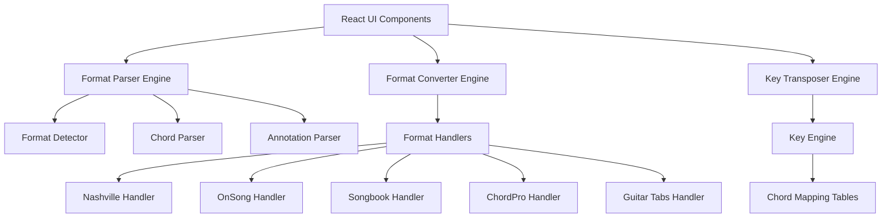

# Design Document

## Overview

The Music Notation Converter is a React/Next.js web application that provides real-time conversion between different music chord notation formats. The application features a split-screen interface with live preview, automatic format detection, key transposition, and annotation handling. The architecture follows a modular design with clear separation of concerns, implementing KISS, SOLID, and DRY principles.

## Architecture

### High-Level Architecture



### Technology Stack

- **Frontend Framework**: Next.js 14 with React 18
- **Styling**: Tailwind CSS for responsive design
- **State Management**: React Context API with useReducer
- **Testing**: Jest + React Testing Library
- **Type Safety**: TypeScript throughout
- **Code Quality**: ESLint + Prettier
- **Font**: JetBrains Mono (monospace) for chord alignment

## Components and Interfaces

### Core Interfaces

```typescript
interface ChordSheet {
  id: string;
  title?: string;
  artist?: string;
  key?: string;
  format: NotationFormat;
  content: string;
  sections: Section[];
  metadata: Metadata;
}

interface Section {
  type: SectionType;
  name: string;
  content: string;
  chords: Chord[];
  annotations: Annotation[];
}

interface Chord {
  root: string;
  quality: string;
  extensions: string[];
  bassNote?: string;
  position: number;
}

interface Annotation {
  text: string;
  format: AnnotationFormat;
  position: 'above' | 'inline' | 'beside';
}

enum NotationFormat {
  NASHVILLE = 'nashville',
  ONSONG = 'onsong',
  SONGBOOK = 'songbook',
  CHORDPRO = 'chordpro',
  GUITAR_TABS = 'guitar_tabs'
}

enum SectionType {
  VERSE = 'verse',
  CHORUS = 'chorus',
  BRIDGE = 'bridge',
  INTRO = 'intro',
  OUTRO = 'outro',
  INSTRUMENTAL = 'instrumental',
  PRE_CHORUS = 'pre_chorus',
  POST_CHORUS = 'post_chorus',
  TAG = 'tag',
  VAMP = 'vamp',
  INTERLUDE = 'interlude'
}
```

### React Component Structure

```
src/
├── components/
│   ├── layout/
│   │   ├── Header.tsx
│   │   ├── Footer.tsx
│   │   └── Layout.tsx
│   ├── editor/
│   │   ├── InputEditor.tsx
│   │   ├── OutputPreview.tsx
│   │   ├── FormatSelector.tsx
│   │   └── KeySelector.tsx
│   ├── controls/
│   │   ├── ConversionControls.tsx
│   │   ├── ExportControls.tsx
│   │   └── MetadataEditor.tsx
│   └── common/
│       ├── Button.tsx
│       ├── Select.tsx
│       └── TextArea.tsx
├── engines/
│   ├── parser/
│   │   ├── FormatDetector.ts
│   │   ├── ChordParser.ts
│   │   ├── AnnotationParser.ts
│   │   └── SectionParser.ts
│   ├── converter/
│   │   ├── FormatConverter.ts
│   │   ├── handlers/
│   │   │   ├── NashvilleHandler.ts
│   │   │   ├── OnSongHandler.ts
│   │   │   ├── SongbookHandler.ts
│   │   │   ├── ChordProHandler.ts
│   │   │   └── GuitarTabsHandler.ts
│   │   └── BaseHandler.ts
│   └── transposer/
│       ├── KeyTransposer.ts
│       ├── ChordMaps.ts
│       ├── KeyDetector.ts
│       └── AutoKeyDetection.ts
├── utils/
│   ├── chordUtils.ts
│   ├── formatUtils.ts
│   └── fileUtils.ts
├── types/
│   ├── chord.types.ts
│   ├── format.types.ts
│   └── app.types.ts
└── constants/
    ├── chordMaps.ts
    ├── keySignatures.ts
    └── formatPatterns.ts
```

## Data Models

### Chord Mapping System

The application uses a comprehensive chord mapping system for key transposition supporting both major and minor keys:

```typescript
const MAJOR_KEY_SIGNATURES = {
  'C': ['C', 'Dm', 'Em', 'F', 'G', 'Am', 'B°'],
  'D': ['D', 'Em', 'F#m', 'G', 'A', 'Bm', 'C#°'],
  'E': ['E', 'F#m', 'G#m', 'A', 'B', 'C#m', 'D#°'],
  'F': ['F', 'Gm', 'Am', 'Bb', 'C', 'Dm', 'E°'],
  'G': ['G', 'Am', 'Bm', 'C', 'D', 'Em', 'F#°'],
  'A': ['A', 'Bm', 'C#m', 'D', 'E', 'F#m', 'G#°'],
  'B': ['B', 'C#m', 'D#m', 'E', 'F#', 'G#m', 'A#°'],
  'Db': ['Db', 'Ebm', 'Fm', 'Gb', 'Ab', 'Bbm', 'C°'],
  'Eb': ['Eb', 'Fm', 'Gm', 'Ab', 'Bb', 'Cm', 'D°'],
  'Gb': ['Gb', 'Abm', 'Bbm', 'Cb', 'Db', 'Ebm', 'F°'],
  'Ab': ['Ab', 'Bbm', 'Cm', 'Db', 'Eb', 'Fm', 'G°'],
  'Bb': ['Bb', 'Cm', 'Dm', 'Eb', 'F', 'Gm', 'A°']
};

const MINOR_KEY_SIGNATURES = {
  'Am': ['Am', 'B°', 'C', 'Dm', 'Em', 'F', 'G'],
  'Bm': ['Bm', 'C#°', 'D', 'Em', 'F#m', 'G', 'A'],
  'C#m': ['C#m', 'D#°', 'E', 'F#m', 'G#m', 'A', 'B'],
  'Dm': ['Dm', 'E°', 'F', 'Gm', 'Am', 'Bb', 'C'],
  'Em': ['Em', 'F#°', 'G', 'Am', 'Bm', 'C', 'D'],
  'F#m': ['F#m', 'G#°', 'A', 'Bm', 'C#m', 'D', 'E'],
  'G#m': ['G#m', 'A#°', 'B', 'C#m', 'D#m', 'E', 'F#'],
  'Cm': ['Cm', 'D°', 'Eb', 'Fm', 'Gm', 'Ab', 'Bb'],
  'Fm': ['Fm', 'G°', 'Ab', 'Bbm', 'Cm', 'Db', 'Eb'],
  'Gm': ['Gm', 'A°', 'Bb', 'Cm', 'Dm', 'Eb', 'F'],
  'Bbm': ['Bbm', 'C°', 'Db', 'Ebm', 'Fm', 'Gb', 'Ab'],
  'Ebm': ['Ebm', 'F°', 'Gb', 'Abm', 'Bbm', 'Cb', 'Db']
};

const MAJOR_NASHVILLE_NUMBERS = ['1', '2m', '3m', '4', '5', '6m', '7°'];
const MINOR_NASHVILLE_NUMBERS = ['1m', '2°', '3', '4m', '5m', '6', '7'];
```

### Auto-Key Detection Algorithm

The application uses a sophisticated algorithm to automatically detect the key of a song:

```typescript
interface KeyDetectionResult {
  key: string;
  confidence: number;
  isMinor: boolean;
  analysis: {
    chordFrequency: Record<string, number>;
    progressionMatches: string[];
    tonicIndicators: number;
  };
}

const KEY_DETECTION_PATTERNS = {
  // Common major key progressions
  major: [
    ['1', '5', '6m', '4'],  // I-V-vi-IV (very common)
    ['1', '4', '5', '1'],   // I-IV-V-I (classic cadence)
    ['6m', '4', '1', '5'],  // vi-IV-I-V (pop progression)
    ['1', '6m', '4', '5'],  // I-vi-IV-V (50s progression)
  ],
  // Common minor key progressions  
  minor: [
    ['1m', '7', '6', '7'],  // i-VII-VI-VII (minor progression)
    ['1m', '4m', '5', '1m'], // i-iv-V-i (harmonic minor)
    ['1m', '6', '7', '1m'],  // i-VI-VII-i (natural minor)
    ['1m', '3', '7', '1m'],  // i-III-VII-i (modal)
  ]
};
```

### Format-Specific Patterns

```typescript
const FORMAT_PATTERNS = {
  nashville: /^[1-7][mb°]?(?:sus[24]?|add[0-9]|maj[0-9]|[0-9]+)?(?:\/[1-7])?$/,
  chord: /^[A-G][#b]?(?:m|maj|dim|aug)?(?:sus[24]?|add[0-9]|[0-9]+)?(?:\/[A-G][#b]?)?$/,
  annotation: {
    onsong: /^\*(.+)$/,
    songbook: /^\((.+)\)$/,
    pco: /^<b>(.+)<\/b>$/
  }
};
```

## Error Handling

### Error Types and Handling Strategy

```typescript
enum ErrorType {
  PARSE_ERROR = 'PARSE_ERROR',
  CONVERSION_ERROR = 'CONVERSION_ERROR',
  TRANSPOSE_ERROR = 'TRANSPOSE_ERROR',
  FORMAT_ERROR = 'FORMAT_ERROR'
}

interface AppError {
  type: ErrorType;
  message: string;
  context?: any;
  recoverable: boolean;
}
```

### Error Handling Approach

1. **Graceful Degradation**: If format detection fails, allow manual format selection
2. **Partial Conversion**: Convert what's possible and highlight problematic sections
3. **User Feedback**: Clear error messages with suggestions for resolution
4. **Fallback Modes**: Provide basic text processing when advanced parsing fails
5. **Validation**: Real-time validation with inline error indicators

## Testing Strategy

### Unit Testing

- **Parser Tests**: Test each format parser with various input samples
- **Converter Tests**: Verify conversion accuracy between all format pairs
- **Transposer Tests**: Test key transposition with complex chord progressions
- **Utility Tests**: Test chord parsing, extension handling, and position calculations

### Integration Testing

- **End-to-End Conversion**: Test complete conversion workflows
- **Format Detection**: Test automatic format detection accuracy
- **Real-time Preview**: Test live preview updates and performance
- **File Operations**: Test import/export functionality

### Test Data Strategy

```typescript
const TEST_SAMPLES = {
  nashville: {
    simple: "1 - 4 - | 5 - 1 - |",
    complex: "1maj7 - 2m7/5 - | 4sus2 - 5/7 - |"
  },
  onsong: {
    simple: "[C]Amazing [F]grace how [G]sweet the [C]sound",
    withAnnotations: "*Slowly\n[C]Amazing [F]grace"
  },
  // ... other format samples
};
```

### Performance Testing

- **Large File Handling**: Test with chord sheets containing 50+ sections
- **Real-time Performance**: Ensure <100ms response time for live preview
- **Memory Usage**: Monitor memory consumption with large documents
- **Concurrent Operations**: Test multiple simultaneous conversions

## Implementation Phases

### Phase 1: Core Infrastructure
- Set up Next.js project with TypeScript
- Implement basic UI layout with split-screen design
- Create core data models and interfaces
- Set up testing framework and initial tests

### Phase 2: Format Detection and Parsing
- Implement format detection engine
- Build parsers for each notation format
- Create chord parsing with extension support
- Add section and annotation parsing

### Phase 3: Conversion Engine
- Implement format conversion handlers
- Build chord positioning system
- Add annotation format conversion
- Implement proper spacing and formatting rules

### Phase 4: Key Transposition
- Build key detection system
- Implement chord mapping tables
- Create transposition engine with extension preservation
- Add slash chord handling (5/7 → G/B)

### Phase 5: User Interface Polish
- Implement real-time preview
- Add export functionality
- Create metadata editing
- Add keyboard shortcuts and accessibility features

### Phase 6: Advanced Features
- Add file import/export
- Implement version control for chord sheets
- Add batch conversion capabilities
- Create user preferences and settings

## Security Considerations

- **Input Sanitization**: Sanitize all text input to prevent XSS attacks
- **File Upload Security**: Validate file types and sizes for imports
- **Client-Side Processing**: All processing happens client-side, no server data storage
- **Content Security Policy**: Implement strict CSP headers
- **Dependency Security**: Regular security audits of npm dependencies